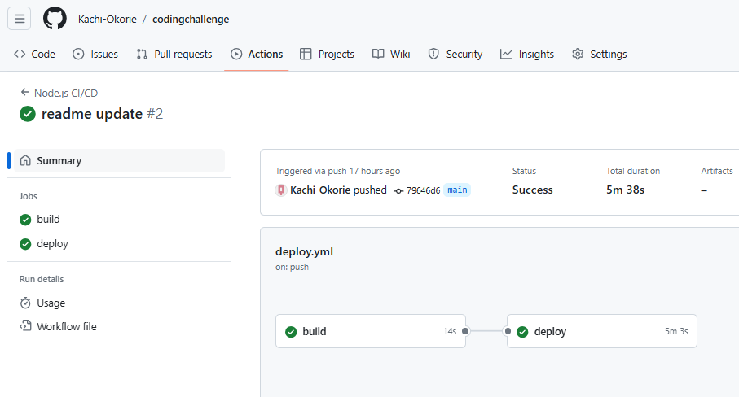
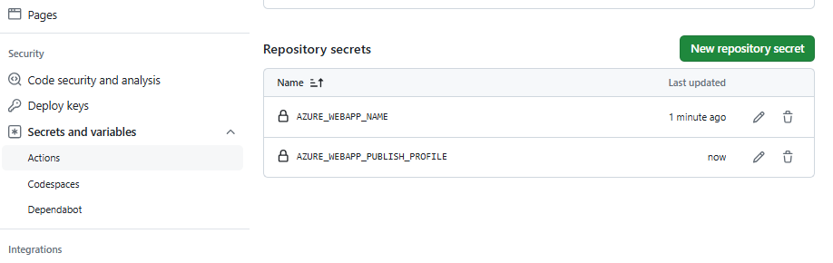
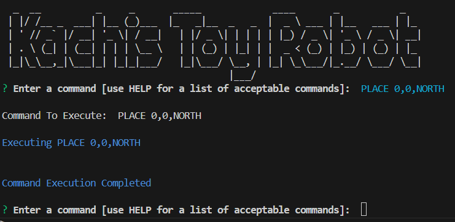
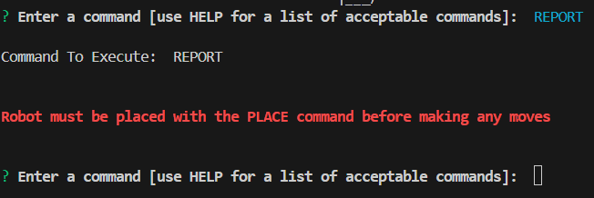

# Table of Content
1. [About the Challenge](#About-the-Challenge)
    - [Task Requirements](##Task-Requirements)
2. [Solution](#Solution)
    - [Node JS](#node-js)
        - [Folder/File Structure](#folderfile-structure)
    - [Code Coverage Test](#code-coverage-test)
    - [Continuous Integration Continous Deployment (CICD)](#continuous-integration-continous-deployment-cicd)
3. [How to Run the Application](#how-to-run-the-application)

# About the Challenge


This challenge is a toy robot challenge which requires the developer to create an application that simulates the movement of a toy robot on a square tabletop  of dimensions 5 x 5.

## Task Requirements

1. Application should be able to read commands of the following form.
    - PLACE X,Y,F
    - MOVE
    - LEFT
    - RIGHT
    - REPORT

2. The application should discard all commands in the sequence until a valid PLACE command has been executed.
3. PLACE will put the toy robot on the table in position X,Y and facing
4. MOVE will move the toy robot one unit forward in the direction it is currently facing.
5. LEFT and RIGHT will rotate the robot 90 degrees in the specified direction without changing the position of the robot.
6. REPORT will announce the X,Y and F of the robot. This can be in any form, but standard output is sufficient.
7. The toy robot must not fall off the table during movement. This also includes the initial placement of the toy robot.

# Solution

To meet the requirements of this challenge various tools were employed and are discussed here.

## Node JS

By utilizing NodeJS for the Toy Robot solution, I leveraged its strengths in handling asynchronous input, modular design, and robust error handling. This makes the implementation efficient, scalable, and easy to maintain.

### Folder/File Structure

```
**node_modules/**

**src/**

*helpers/*: contains files to provide utility functions for logging messages with different styles and formatting, as well as a helper function to build an object from an array of data.

*modules/*: contains the robot.js and simulation.js files. The robot.js file defines the Robot class with methods to handle the commands and the simulation.js file which  manages the command processing and execution for the Toy Robot application. It allows the robot to be controlled through commands provided either in a file or via an interactive command-line prompt.

*tests/*: contains test scripts for the application.

*app.js*: Entry point of the application, responsible for reading input and invoking the appropriate methods on the Robot instance.

*commands.txt*: A file containing a sequence of commands for the robot.

```

## Code Coverage Test

Code coverage was used to measure and report the coverage of my code using defined tests.
The coverage output directory has the below structure.

```
 project_root/
└── coverage/
    ├── lcov-report/
    │   └── index.html
    ├── lcov.info
    |__ clover.xml
    |
    └── coverage-final.json
```

## Continuous Integration Continous Deployment (CICD)

To incoprorate a DevOps approach into the design, I set up a workflow on GitHub Actions which builds and deploys the code to an Azure Web App.

Below is a snippet of the configured pipeline.



Before running the pipeline, ensure that the Secrets have been updated on GitHub as shown below.



__NOTE__: to attain a successful deploy job, you would need to have permission to push to my GitHub repository and an Azure Web App needs to be recreated as the initial one was deleted to save cost.

# How to Run the Application

It is assumed that you already have Node JS installed on your laptop and you have the ability to clone a repository.

## Step 1

Clone this repository

```
git clone https://github.com/Kachi-Okorie/codingchallenge.git
```

## Step 2

Install required modules

```
npm install
```

## Step 3

Start the application

```
npm start
```

## Step 4

### Type in the commands

1. Based on the task requirement to "discard all commands in the sequence until a valid PLACE command has been executed." Run the PLACE command first as seen below.

    

2. Failure to do so (that is you start with a command other than PLACE) will result in an error as shown below.

    

3. Type in HELP for a list of acceptable commands.